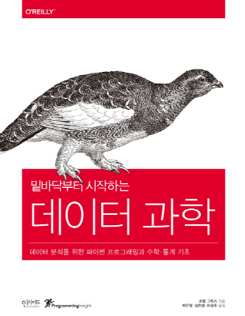

# 밑바닥부터 시작하는 데이터 과학

-원서명 : Data Science from Scratch: First Principles with Python

-지은이 : Joel Grus

-원서 : http://shop.oreilly.com/product/0636920033400.do

-번역서 : http://www.insightbook.co.kr/books/programming-insight

-출판사 예제코드 : https://github.com/insight-book/data-science-from-scratch

### Chapter01. Introduction
- 설명
> 유저들과 유저들의 각 관심사, 연봉과 연차 등을 기반으로 기본적인 데이터과학의 컨셉을 설명하고, 16장의 추천시스템 그리고 20장의 자연어처리의
> 내용을 간략하게 보여준다. 

- 느낀점
> 파이썬의 참조의 개념을 활용하여 dict 안의 dict를 만드는 부분이 능숙하지 않은 듯 하다. SNS의 유저의 친구목록이라고 하면 1번이라는 유저에게
> 2,3번 유저의 Dict 형 타입을 1번 유저의 친구목록에 넣어주면 참조하게 되고 Print를 찍었을 때, 구조가 복잡하게 출력된다. 하지만 보다 능숙하게
> 파이썬을 다루기 위해선 이해해야 할 개념이다. 
>
> 더해서 If문을 활용하여 범위를 설정해주는 함수를 만들고 (Bucket함수) 이 출력값을 세 가지 정도로 설정해준 뒤, 출력값을 key 값으로 하여
> list 값들을 분류해서 구간을 분할해주는 개념도 기억해두면 좋을 듯 싶다.
### Chapter02. Python
- 설명
> 

- 느낀점
> 

